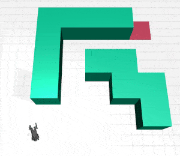
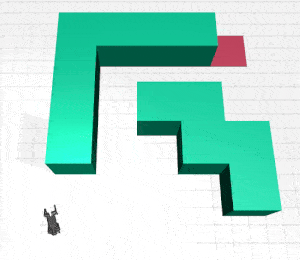

# gemini_maze_exploration
A playground using LLM to explore/navigate a robot through an unknown environment

## Description
Basic logic
```text
LLM-Guided Navigation System
---------------------------
Algorithm Overview:
1. Agent starts at random position (-0.5 to 0.5)
2. LLM receives current position → generate waypoint sequence suggestions
3. Agent moves step-by-step through waypoints
4. Success: All waypoints reached -> End
   Failure: Hit invalid grid cell -> Promptback the LLM for another suggestion

Trial Loop:
    START → Send position to LLM → Get waypoints → Navigate → Check result
    - If success: End
    - If failure: Retry with new initial position (max 20 trials)

Navigation Loop:
    Move → Record position → Check grid → Update target
```

## Usage
The demo can be run using free tier Google API key. Python >= 3.10 is required.

[](https://colab.research.google.com/github/shaoanlu/gemini_maze_exploration/blob/main/notebooks/colab_demo.ipynb)

## Result


 

## Learning note
- Success rate is not 100%
  - Prompt quality is crucial
  - Include only necessary information to prevent reaching maximum token length
- LLM do not reason or do actual planning but only generates possible text.
- LLM is most suitable for providing suggestions/candidates based on instructions and feedbacks.
  - In practice, validation should be done using external verifier (i.e. simulation)
- Comparison between `gemini-2.0-flash-exp` and `gemini-2.0-flash-thinking-exp`
  - Thinking model is better at following the instruction such as maximum waypoints in the suggestion
    - With the trade-off of consecutively outputing the same suggestion?
  - General model is better at exploration with different attemps.
- Used Claude to refactor the code. It saved a lot of time but the result can be suboptimal.
  - Again, prompt quality is crucial
- When asked the LLM to produce one waypoint at a time (each time w/ an image of the last frame of the simulation) instead of a list of wps, LLM navigates the robot to the goal posiiton after 35 steps and it seems like LLM was just providing exhaustive tries instead of using visual/spatial information for better navigation (see animation below)
  - Maybe because I'm using an ordinary gemini instead of a gemioni-thinking moidel?
  - probably unable to recognize the robot in the image? due to low resolution? too long tokens?
  - Besides, I previous also experienced that LLM unable to judge whether a quadruped has fdalled down in an image. Maybe it is jmust not as smart as I think or the mujoco sim image is just out of domain.

