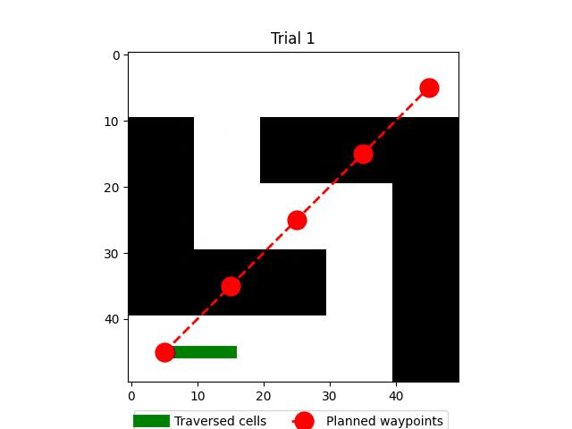

# gemini_maze_exploration
A playground using LLM to explore/navigate a robot through an unknown environment

## Description
Basic logic
```text
LLM-Guided Navigation System
---------------------------
Algorithm Overview:
1. Agent starts at random position (-0.5 to 0.5)
2. LLM receives current position → generate waypoint sequence suggestions
3. Agent moves step-by-step through waypoints
4. Success: All waypoints reached -> End
   Failure: Hit invalid grid cell -> Promptback the LLM for another suggestion

Trial Loop:
    START → Send position to LLM → Get waypoints → Navigate → Check result
    - If success: End
    - If failure: Retry with new initial position (max 20 trials)

Navigation Loop:
    Move → Record position → Check grid → Update target
```

## Usage
The demo can be run using free tier Google API key.

[](https://colab.research.google.com/github/shaoanlu/gemini_maze_exploration/blob/main/colab_demo.ipynb)

## Result
 

## Learning note
- Success rate is not 100%
  - Prompt quality is crucial
  - Include only necessary information to prevent reaching maximum token length
- LLM is mainly for providing suggestions. Validation should be done using external verifier (i.e. simulation)
- LLM do not reason but generates possible text.
- Comparison between `gemini-2.0-flash-exp` and `gemini-2.0-flash-thinking-exp`
  - Thinking model is better at following the instruction such as maximum waypoints in the suggestion
    - With the trade-off of consecutively outputing the same suggestion?
  - General model is better at exploration with different attemps.
